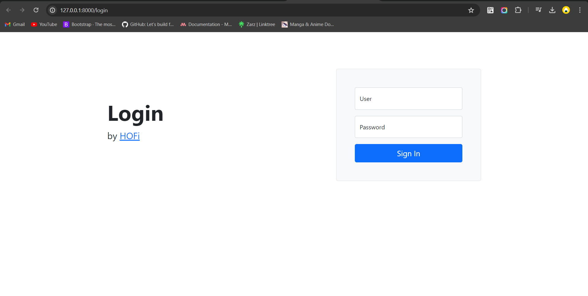
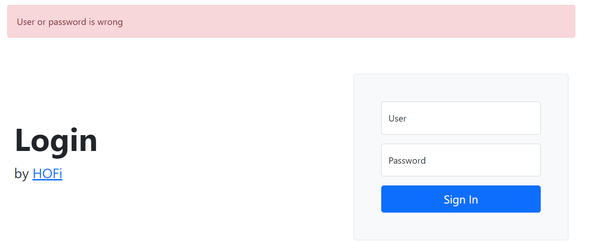
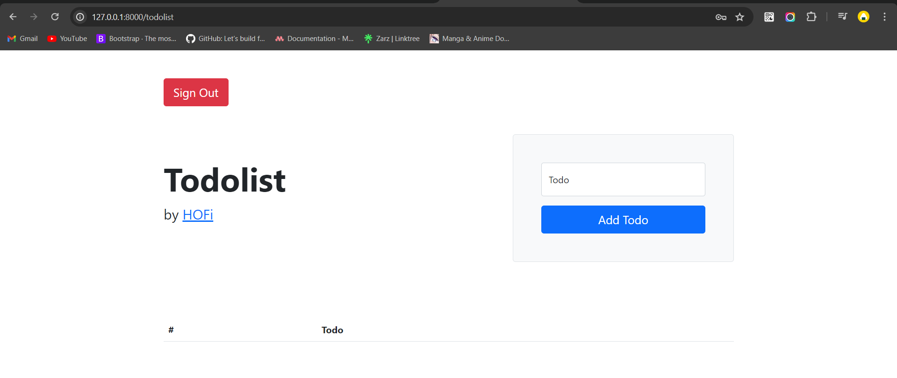
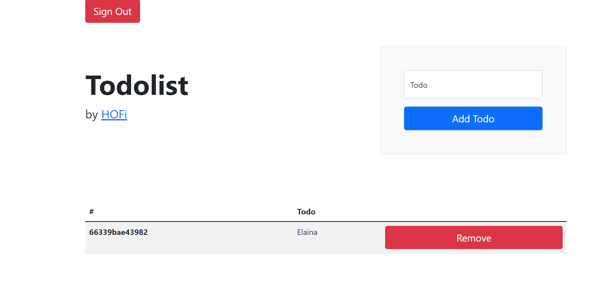
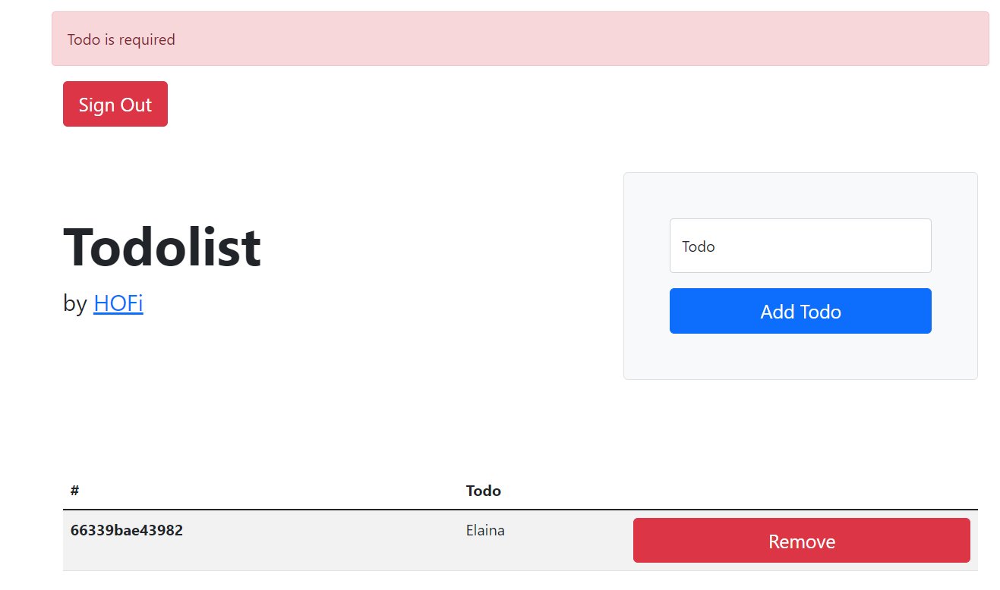

<center>

# STUDI KASUS LARAVEL DASAR

</center>

<center>

## POINT UTAMA

</center>

### 1. Membuat project

-   Minimal versi `PHP` ada versi 8,

-   Dan composer versi 2 atau lebih,

-   Pada cmd gunakan perintah `composer create-project laravel/laravel=9.15 studi-kasus-laravel-dasar`.

---

### 2. Membuat logic login

-   Dalam studi kasus ini, saya tidak menggunakan database untuk menyimpan user login dan todo,

-   Dan untuk logic login nya diganti dengan menggunakan dengan menggunakan session `array` untuk user login.

    ```PHP
     private array $users = [
        "akbar" => "rahasia" // username & pass
    ];

    // function untuk login
    function login(string $user, string $password): bool
    {
        if(!isset($this->users[$user])){
            return false;
        }

        $correctPassword = $this->users[$user];
        return $password == $correctPassword;
    }
    ```

-   Unit test login

    ```PHP
    public function testLoginSuccess() //ketika login berhasil
    {
        $this->post('/login', [
            "user" => "akbar",
            "password" => "rahasia"
        ])->assertRedirect("/")
            ->assertSessionHas("user", "akbar");
    }
    ```

---

### 3. Template halaman web

-   Template halaman web berada didalam directory `resources/view/`.

-   Test template

    ```PHP
    Route::view('/template', 'template');
    ```

---

### 4. Membuat user controller

-   Untuk memanggil halaman login & logout.

-   Function User login benar

    ```PHP
      public function login(): Response
    {
        return response()
            ->view("user.login", [
                "title" => "Login"
            ]);
    }
    ```

-   Function user login ketika salah

    ```PHP
    public function doLogin(Request $request): Response|RedirectResponse
    {
        $user = $request->input('user');
        $password = $request->input('password');

        // validate input
        if (empty($user) || empty($password)) {
            return response()->view("user.login", [
                "title" => "Login",
                "error" => "User or password is required"
            ]);
        }

        if ($this->userService->login($user, $password)) {
            $request->session()->put("user", $user);
            return redirect("/");
        }

        return response()->view("user.login", [
            "title" => "Login",
            "error" => "User or password is wrong"
        ]);
    }
    ```

-   Fuction user logout

    ```PHP
    public function doLogout(Request $request): RedirectResponse
    {
        $request->session()->forget("user");
        return redirect("/");
    }
    ```

-   Menampilkan halaman login & logout

    ```PHP
    Route::controller(\App\Http\Controllers\UserController::class)->group(function () {
    Route::get('/login', 'login')->middleware([\App\Http\Middleware\OnlyGuestMiddleware::class]);
    Route::post('/login', 'doLogin')->middleware([\App\Http\Middleware\OnlyGuestMiddleware::class]);
    Route::post('/logout', 'doLogout')->middleware([\App\Http\Middleware\OnlyMemberMiddleware::class]);
    });
    ```

---

### 5. Membuat Todolist Service

-   Todolist service

    ```PHP
    private TodolistService $todolistService;

    public function __construct(TodolistService $todolistService)
    {
        $this->todolistService = $todolistService;
    }
    ```

-   Unit test todolist service

    ```PHP
    private TodolistService $todolistService;

    protected function setUp(): void
    {
        parent::setUp();

        $this->todolistService = $this->app->make(TodolistService::class);
    }
    public function testTodolistNotNull()
    {
        self::assertNotNull($this->todolistService);
    }
    ```

---

### 6. Membuat logic Menambah Todo

-   Kode menambah todo

    ```PHP
        public function saveTodo(string $id, string $todo): void; // app/Services
    ```

    ```PHP
    public function saveTodo(string $id, string $todo): void
    {
        if (!Session::exists("todolist")) {
            Session::put("todolist", []);
        }

        Session::push("todolist", [
            "id" => $id,
            "todo" => $todo
        ]);
    } // app/Services/Impl
    ```

-   Unit test menambah todo

    ```PHP
    public function testSaveTodo()
    {
        $this->todolistService->saveTodo("2", "Gusti");

        $todolist = Session::get("todolist");
        foreach ($todolist as $value) {
            self::assertEquals("2", $value['id']);
            self::assertEquals("Gusti", $value['todo']);
        }
    }
    ```

---

### 7. Membuat Logic Mengambil Todo

-   Kode mengambil todo

    ```PHP
        public function getTodolist(): array;
    ```

    ```PHP
     public function getTodolist(): array
    {
        return Session::get("todolist", []);
    }
    ```

-   Unit test mengambil todo

    ```PHP
    // Ketika todo kosong
    public function testGetTodolistEmpty()
    {
        self::assertEquals([], $this->todolistService->getTodolist());
    }

    // Ketika ada todo
    public function testGetTodolistNotEmpty()
    {
        $expected = [
            [
                "id" => "1",
                "todo" => "Gusti"
            ],
            [
                "id" => "2",
                "todo" => "Elaina"
            ]
        ];

        $this->todolistService->saveTodo("1", "Gusti");
        $this->todolistService->saveTodo("2", "Elaina");

        self::assertEquals($expected, $this->todolistService->getTodolist());
    }
    ```

---

### 8. Membuat Logic Menghapus Todo

-   Kode menghapus todo

    ```PHP
        public function removeTodo(string $todoId);
    ```

    ```PHP
    ublic function removeTodo(string $todoId)
    {
        $todolist = Session::get("todolist");

        foreach ($todolist as $index => $value) {
            if ($value['id'] == $todoId) {
                unset($todolist[$index]);
                break;
            }
        }

        Session::put("todolist", $todolist);
    }
    ```

-   Unit test menghapus todo

    ```PHP
        public function testRemoveTodo()
    {
        $this->todolistService->saveTodo("1", "Gusti");
        $this->todolistService->saveTodo("2", "Elaina"); // Tambah todo

        self::assertEquals(2, sizeof($this->todolistService->getTodolist()));

        $this->todolistService->removeTodo("3"); // hapus todo yang tidak ada

        self::assertEquals(2, sizeof($this->todolistService->getTodolist()));

        $this->todolistService->removeTodo("1"); // hapus todo yang ada

        self::assertEquals(1, sizeof($this->todolistService->getTodolist()));

        $this->todolistService->removeTodo("2");

        self::assertEquals(0, sizeof($this->todolistService->getTodolist()));
    }
    ```

---

### 9. Membuat Todolist Controller

-   Kode todo controller

    ```PHP
    $todo = $request->input("todo");

        if (empty($todo)) {
            $todolist = $this->todolistService->getTodolist();
            return response()->view("todolist.todolist", [
                "title" => "Todolist",
                "todolist" => $todolist,
                "error" => "Todo is required"
            ]);
        }
    ```

---

### 10. Membuat Todolist Page

-   Kode membuat todolist page

    ```PHP
    public function todoList(Request $request)
    {

    } // app/Controllers
    ```

    ```PHP
    Route::controller(\App\Http\Controllers\TodolistController::class)->group(function () {
        Route::get('/todolist', 'todoList');
        Route::post('/todolist', 'addTodo');
        Route::post('/todolist/{id}/delete', 'removeTodo');
    });
    ```

---

### 11. Membuat Aksi Tambah & Hapus Todo

-   Kode aksi tambah todo

    ```PHP
    public function addTodo(Request $request)
    {
        $todo = $request->input("todo");

        if (empty($todo)) {
            $todolist = $this->todolistService->getTodolist();
            return response()->view("todolist.todolist", [
                "title" => "Todolist",
                "todolist" => $todolist,
                "error" => "Todo is required"
            ]);
        }

        $this->todolistService->saveTodo(uniqid(), $todo);

        return redirect()->action([TodolistController::class, 'todoList']);
    } // app/Controllers

    ```

-   Kode aksi hapus todo

    ```PHP
    public function removeTodo(Request $request, string $todoId): RedirectResponse
    {
        $this->todolistService->removeTodo($todoId);
        return redirect()->action([TodolistController::class, 'todoList']);
    }
    ```

---

### 12. Unit Test Aksi Tambah & Hapus Todo

-   Unit test tambah

    ```PHP
    public function testAddTodoSuccess()
    {
        $this->withSession([
            "user" => "akbar"
        ])->post("/todolist", [
            "todo" => "Gusti"
        ])->assertRedirect("/todolist");
    }
    ```

-   Unit test aksi hapus

    ```PHP
    public function testRemoveTodolist()
    {
        $this->withSession([
            "user" => "akbar",
            "todolist" => [
                [
                    "id" => "1",
                    "todo" => "Gusti"
                ],
                [
                    "id" => "2",
                    "todo" => "Elaina"
                ]
            ]
        ])->post("/todolist/1/delete")
            ->assertRedirect("/todolist");
    }
    ```

---

### 13. Tampilan Login

-   Tampilan login

    

-   Tampilan login ketika user/pass salah

    

-   Tampilan berhasil login

    

-   Tambah todo

    

-   Tambah todo kosong
    

---

## PERTANYAAN & CATATAN TAMBAHAN

-   tidak ada

## KESIMPULAN

-
